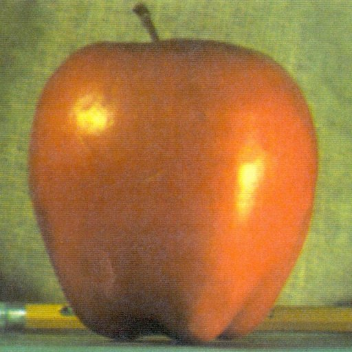
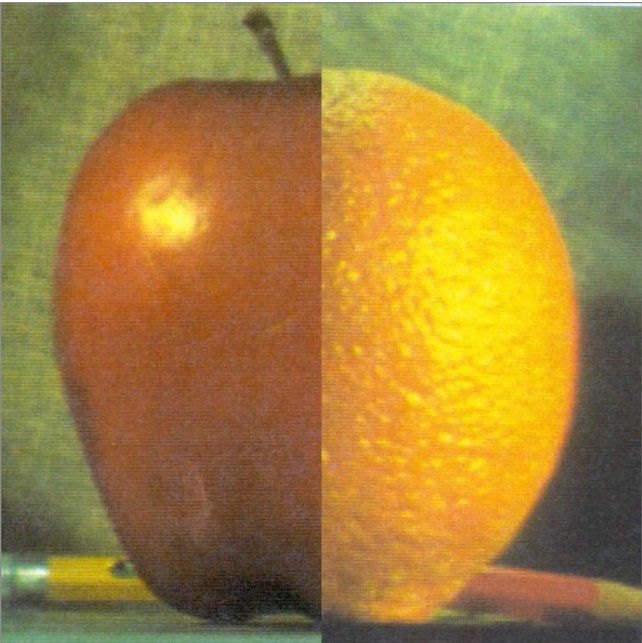
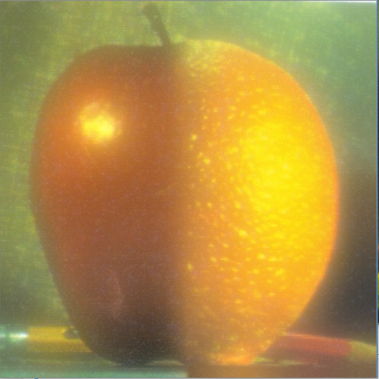

# Image Bleding
---

### Table of Contents
You're sections headers will be used to reference location of destination.

- [Demo](#demo)
- [Overview](#overview)
- [How To Use](#how-to-use)
- [Tool Used](#tool-used)
- [Author Info](#author-info)

---

### Demo

<h3>Orignal Pictures</h3>

<h3>Concatinated Pictures</h3>

<h3>Blended Pictures</h3>

---

### Overview

This app is created for bleding two given image smoothly using OpenCV library in python without using any photoshop external software as show in the above pictures where a orange and apple pictures is blend bueatifully without any image distortion, disturbance or noises.

### How To Use

You can simply download the code though zip download option or clone or fork the repo then run it in your favourite IDE or Notebooks and play with different pictures that you wanna blend with each other for the desired or required result.

### References
1.Google
2.OpenCV Api doccumentation

---

### Tool Used

---

### Author's Info

- Twitter - [@taronic777](https://twitter.com/taronic777)
- linkedIn - [Tarun Yadav](https://www.linkedin.com/in/tarun-yadav-47442112b/)

[Back To The Top](#read-me-template)
